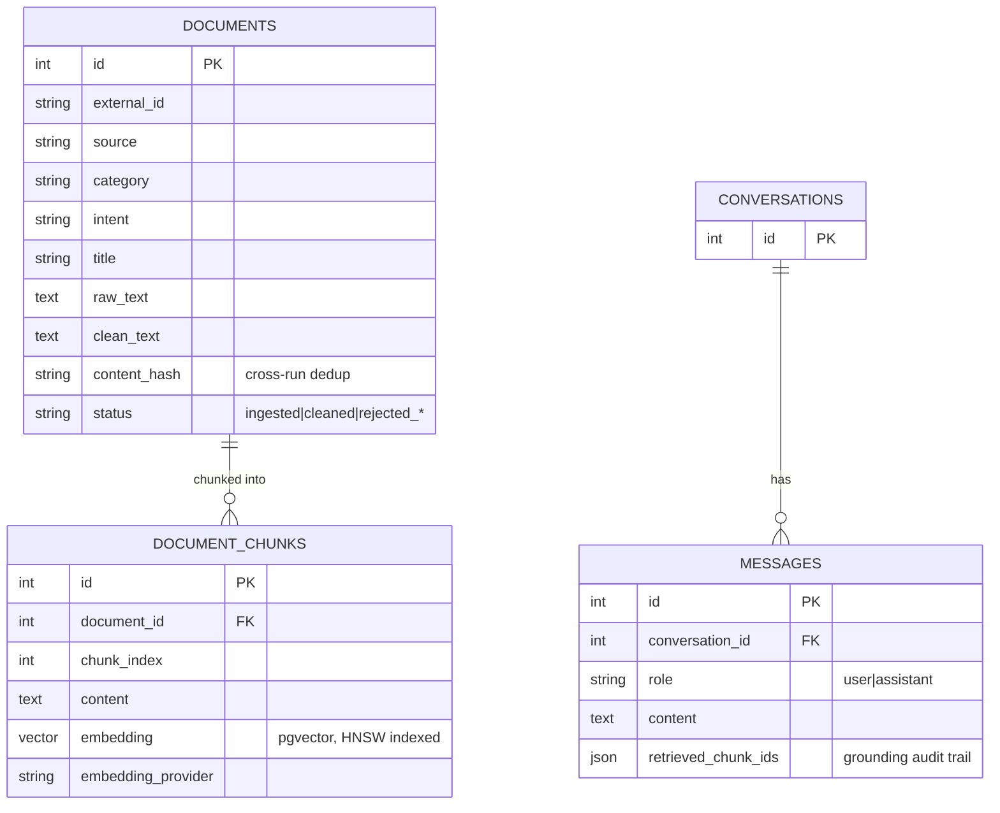

# Architecture

This document explains *why* the system is put together the way it is —
the layering, the pluggable-provider pattern, the database schema, and the
trade-offs made along the way. For "how do I run it," see
[setup.md](setup.md); for "what does the API return," see [api.md](api.md).

## Design goals

The brief for this project was to combine data ingestion, storage,
cleaning, and model deployment into **one cohesive application** rather than
isolated scripts. Three things follow directly from that:

1. **One schema, not one file per stage.** Ingested, cleaned, and embedded
   state all live in the same Postgres database (`documents` and
   `document_chunks`), with a `status` column tracking where each document
   is in the pipeline. There's no intermediate CSV/pickle handoff between
   stages — the database *is* the handoff.
2. **One orchestrator, two entrypoints.** `rag_support.rag.pipeline` has
   exactly one implementation of "ingest, then clean, then embed" and one
   implementation of "retrieve, then generate." The FastAPI routes and the
   Typer CLI commands are both thin wrappers that call into the same code —
   see `api/routers/ingest.py` and `cli.py`'s `pipeline` command call the
   literal same `run_ingest_clean_embed` function.
3. **Deployable, not just runnable.** A Dockerfile, a docker-compose stack,
   Alembic migrations (not `create_all()` in production), health checks,
   and a CI pipeline that runs the real test suite against a real database
   on every push.

## Layers

```
DataSource  →  ingestion  →  cleaning  →  embeddings  →  storage (Postgres+pgvector)
                                                                │
                                                                ▼
                                              retriever  →  LLM provider  →  API / CLI / UI
```

Each arrow is a narrow, typed interface, not a shared mutable blob:

- **`data/sources/base.py`** — `DataSource.fetch() -> Iterator[RawRecord]`.
  `HuggingFaceSource` and `LocalSampleSource` both implement it; ingestion
  code never knows which one it's talking to.
- **`cleaning/`** — pure functions (`clean_text`, `content_hash`,
  `chunk_text`) with no database dependency, orchestrated by
  `cleaning/pipeline.py::run_cleaning`, which is the only place that talks
  to the repository layer for this stage.
- **`embeddings/base.py`** — `EmbeddingProvider.embed(texts) -> vectors`.
  Three implementations (`openai_embedder.py`, `local_embedder.py`,
  `offline_embedder.py`) behind `embeddings/factory.py::get_embedding_provider`.
- **`llm/base.py`** — `LLMProvider.generate(question, context, history) -> str`.
  Same pattern, same factory shape, in `llm/`.
- **`storage/repository.py`** — the *only* module that writes ORM queries.
  Nothing else imports `sqlalchemy.select` directly. This is what makes the
  DAO layer testable in isolation (`tests/test_repository.py`) and keeps
  the "how is a similar-chunk query actually written" logic in one place.
- **`rag/pipeline.py`** — `RAGPipeline.chat()` and `run_ingest_clean_embed()`,
  the two orchestrators everything else calls into.

## Why Postgres + pgvector (not a dedicated vector DB, not FAISS)

The brief calls for a "storage" component, not just a vector index. A
customer support assistant needs to store documents, chunks, conversations,
and message history with real relational structure (foreign keys, cascade
deletes, status tracking) *and* do vector similarity search — Postgres with
the pgvector extension does both in one engine, one connection pool, one
set of migrations, and one transaction boundary (a chat turn's retrieved
chunks and the message that cites them are written in the same
transaction). A dedicated vector database (Qdrant, Pinecone) would need a
second system just to hold the relational data pgvector already handles for
free, and FAISS has no persistence or query story at all beyond an index
file on disk.

The `document_chunks.embedding` column uses an **HNSW index**
(`vector_cosine_ops`) rather than `ivfflat`: HNSW doesn't need a training
step or a minimum row count to be effective, which matters for a corpus
that starts small and grows incrementally (exactly the sample-dataset →
full-Bitext-dataset story this project tells). See the first Alembic
migration for where it's created.

### The fixed-dimension trade-off

pgvector requires a column's vector width to be fixed at creation time.
This project pins it via `Settings.vector_dim` (default 512, matching the
offline hashing tier) rather than trying to support all three embedding
providers' native dimensions (1536 for OpenAI, 384 for local MiniLM, 512
offline) simultaneously. **Switching `EMBEDDING_PROVIDER` to one with a
different native dimensionality requires a new Alembic migration to alter
the column width, plus re-embedding the whole corpus** — there's no
mixing-and-matching embeddings from different tiers in one column.

This was a deliberate choice over the alternative (a fixed-size
dimensionality-normalizing projection layer — e.g. a seeded random
Johnson–Lindenstrauss projection down to a canonical width for every
provider) because that projection is itself an approximation that trades
away some retrieval quality to buy provider-switching convenience most
deployments don't actually need: you pick one embedding provider for a
given corpus and stay on it, the same way you'd pick one embedding model
in any production RAG system. It's listed under "future improvements"
below as a legitimate alternative design, not a gap.

## The pluggable-provider pattern

Both `embeddings/factory.py` and `llm/factory.py` implement the same shape:

```python
def get_X_provider(settings: Settings) -> XProvider:
    if mode == EXPLICIT_TIER:
        return build_that_tier(settings)   # raises loudly if prerequisites are missing
    # mode == AUTO:
    if tier_1_available(settings): return build_tier_1(settings)
    if tier_2_available():         return build_tier_2(settings)
    return build_tier_3(settings)          # always available, no deps
```

An explicit mode (`EMBEDDING_PROVIDER=openai`) is a *promise* — if the
prerequisite isn't met (no API key), it raises immediately rather than
silently falling back, because a production deployment that thinks it's
using OpenAI and is silently serving hashing-vector-quality retrieval is a
worse failure mode than a crash at startup. `auto` is for development and
demos, where graceful degradation is exactly what you want.

The offline tiers (`OfflineEmbedder`, `ExtractiveLLM`) aren't a toy — they
make the entire pipeline runnable end-to-end with zero external
dependencies, which is what let every stage of this project be verified
against a live database as it was built (see the git history: every commit
that adds a pipeline stage also runs it for real, not just unit-tests it in
isolation). They're explicitly documented as *not* the production-quality
choice; `OfflineEmbedder`'s docstring and startup log line both say so.

## Why this project doesn't ingest live from Hugging Face by default

`DATA_SOURCE=sample` (the default) is not a design compromise for its own
sake — it's a direct consequence of where this project was built and
tested: a sandboxed container with an explicit egress allowlist that does
**not** include `huggingface.co` (`curl -I https://huggingface.co` returns
`403 Forbidden` from that environment; `pypi.org` and `github.com` are
reachable). `HuggingFaceSource` is fully implemented and correct — it's the
"production" data source, meant for environments with normal internet
access (a laptop, a CI runner without an unusual egress policy, most
Docker hosts) — but it can't be exercised from inside the environment this
project was authored in.

Rather than either (a) silently working around this by faking Hugging Face
data, or (b) leaving the limitation undocumented, the project treats it as
a real architectural constraint and designs for it the same way a
production system designs for a flaky or firewalled upstream: a pluggable
`DataSource` interface with an offline-first default, and an error message
in `HuggingFaceSource.fetch()` that explains exactly what to do
(`DATA_SOURCE=sample`) if the same thing happens to you.

See [data_pipeline.md](data_pipeline.md) for how the bundled sample dataset
was generated, and why ~15% of it is deliberately corrupted.

## Database schema



`messages.retrieved_chunk_ids` is what makes every assistant reply
auditable after the fact: given a message, you can always answer "what,
exactly, was this grounded in" without re-running retrieval.

## A migration mistake worth knowing about

The second Alembic migration (`86bedb422f4b`, adding `documents.content_hash`)
was generated with `alembic revision --autogenerate`, which diffed the live
database against the SQLAlchemy declarative metadata and concluded that
`ix_document_chunks_embedding_hnsw` should be dropped. It shouldn't — that
index is real and was created deliberately in the first migration via a raw
`op.execute(...)` (pgvector's HNSW index type isn't something
`Index(...)` in declarative metadata can express the same way a plain
B-tree index can), so autogenerate's diff, which only compares against
declared metadata, doesn't know it exists and treats it as drift. The
migration file has a comment explaining this for the next person who runs
`--autogenerate` here. This is a good example of why generated migrations
should always be read, not just applied — see the git history for the
commit where this was caught and fixed before it shipped.

## Future improvements

Documented deliberately rather than silently punted on:

- **Background ingestion.** `POST /ingest` runs synchronously; fine for the
  sample dataset (sub-second), too slow for the full ~27k-row Bitext
  dataset in one HTTP request. A task queue (Celery/RQ/arq) or FastAPI
  `BackgroundTasks` with a polling status endpoint is the natural next step.
- **Cross-provider embedding compatibility** via a canonical-dimension
  projection layer (see "the fixed-dimension trade-off" above), if a
  deployment genuinely needs to A/B different embedding providers against
  the same stored corpus without re-embedding.
- **LLM-judged groundedness scoring** in `scripts/evaluate.py`, alongside
  the current retrieval-only metrics (Hit@K, MRR) — an LLM-as-judge pass
  checking whether generated answers actually stay within their cited
  context, not just whether the right context was retrieved.
- **Ingestion-time upsert by `external_id`** instead of always appending —
  currently, re-running ingestion against an unchanged source produces new
  `documents` rows that the cleaning stage's persisted `content_hash` dedup
  correctly no-ops on (verified in `docs/api.md`'s `/ingest` example), but
  they still sit in the table as `rejected_duplicate` rows rather than
  never being inserted at all.
